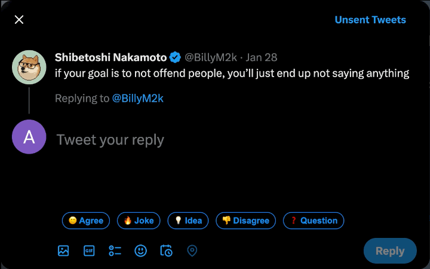

# Getreply 

A Google Chrome extension that auto-generates replies for tweets and LinkedIn posts using OpenAI.

## Supports

## Quick Start

- Create an OpenAI account and generate your API key.

- Go into the code directory and create a new `.env` file For example see [.env.sample](.env.sample) file.

- In the code directory, run the following command in your terminal to install dependencies.

`npm install`

- Then, to start the server run:

`npm run start`

- Now in the Chrome's extension page click on `Load unpacked` and select the code folder.

## How It Works

## License

[MIT](LICENSE)
